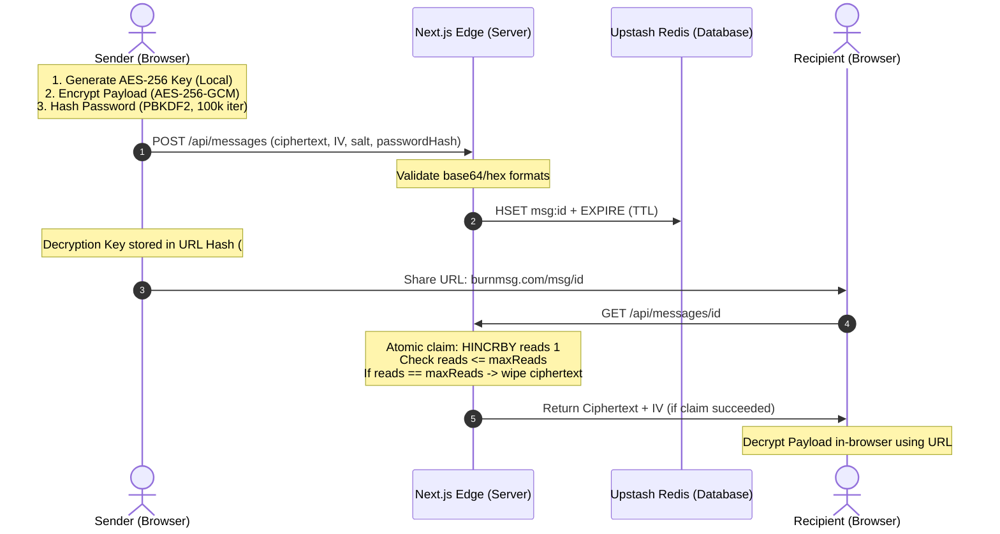

# 🔒 BurnMsg

> **Zero-Knowledge, Ephemeral Messaging Platform**  
> Encrypt text, voice memos, and files entirely in-browser. Sent to the edge, destroyed instantly after reading.

BurnMsg is built with a strict **Zero-Knowledge Architecture**. The server only acts as a blind relay. Content is encrypted client-side using **AES-256-GCM** before transmission, and the decryption key resides exclusively in the URL hash fragment—**meaning the server never sees the key, nor can it ever decrypt your data.**

---

## 🛠️ Cryptographic Architecture



### Specifications
* **Encryption standard**: AES-256-GCM via the native Web Crypto API.
* **Key Generation**: Cryptographically secure pseudo-random number generator (`crypto.getRandomValues()`).
* **Zero-Knowledge Boundary**: The decryption key is passed via the URL hash fragment (`#key`). Because browsers do not transmit hash fragments in HTTP requests, the key never touches the network or the server.
* **Password Hashing**: PBKDF2 with 100,000 iterations using HMAC-SHA-256, computed entirely client-side.
* **Timing-Attack Protection**: Backend comparisons of verification hashes use constant-time comparison via Node's `crypto.timingSafeEqual` to eliminate side-channel timing leaks.
* **Race Condition Mitigation**: Message read tracking is executed via atomic Redis `HINCRBY` operations pipelined with `TTL` checks, removing Time-of-Check to Time-of-Use (TOCTOU) vulnerabilities.

---

## ⚡ Technical Stack

* **Frontend & Routing**: Next.js 14+ (App Router)
* **Ephemeral Store**: Upstash Redis (Global Serverless Edge Distribution)
* **Crypto Subsystem**: Web Crypto API (Client-side)
* **Styling**: Vanilla CSS (Zero UI Frameworks, strict design system tokens)
* **Rate Limiting**: Pipelined distributed sliding-window rate limiter via Upstash Redis

---

## 🔒 Hardened Security Profile

* **Content Security Policy (CSP)**: Locked down with no `'unsafe-eval'` to eliminate XSS escalation vectors.
* **Strict Privacy Headers**: `Referrer-Policy: no-referrer` prevents leakage of message IDs through third-party links.
* **No CDN Tracking**: Zero external CDNs or Google Font API calls. Fonts are self-hosted via `next/font` to protect user IPs.
* **Brute-Force Lockout**: Automatic payload destruction (wiping the ciphertext from Redis) after 5 consecutive incorrect password attempts.

---

## 🚀 Getting Started

### Prerequisites
* Node.js 18+
* Upstash Redis database (or any Redis compatible instance)

### Installation

1. Clone the repository:
   ```bash
   git clone https://github.com/rendragonnn/burn-msg.git
   cd burn-msg
   ```

2. Install dependencies:
   ```bash
   npm install
   ```

3. Setup environment variables:
   Create a `.env.local` file in the root directory:
   ```env
   UPSTASH_REDIS_REST_URL="your-upstash-redis-url"
   UPSTASH_REDIS_REST_TOKEN="your-upstash-redis-token"
   TELEGRAM_BOT_TOKEN="your-optional-telegram-bot-token"
   ```

4. Run the development server:
   ```bash
   npm run dev
   ```

### Production Build
```bash
npm run build
npm run start
```

---

## 📄 License

MIT. Free for modification and redistribution under the terms of the MIT License.
